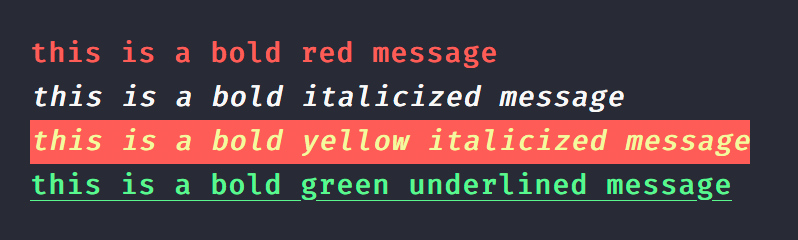
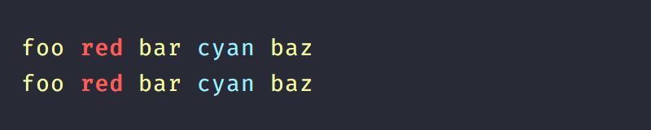
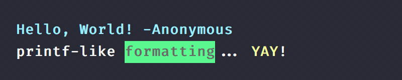

<div align="center">
  
</div>

<div align="center">
  <a href="https://npmjs.org/package/kleur">
    
  </a>
  <a href="https://travis-ci.org/lukeed/kleur">
    
  </a>
  <a href="https://npmjs.org/package/kleur">
    
  </a>
</div>

<div align="center">The fastest Node.js library for formatting terminal text with ANSI colors~!</div>

## Features

* No dependencies
* Super [lightweight](##load-time) & [performant](#performance)
* Supports [nested](#nested-methods) & [chained](#chained-methods) colors
* No `String.prototype` modifications
* Supports [`printf`](#printf-formatting) formatting
* Conditional [color support](#conditional-support)
* Familiar [API](#api)

_Heavily inspired by [`ansi-colors`](https://github.com/doowb/ansi-colors). See [Credits](#credits) for more info!_


## Install

```
$ npm install --save kleur
```


## Usage

```js
const kleur = require('kleur');

// basic usage
kleur.red('red text');

// or variadic arguments
kleur.red('this', 'is', 'also', 'red');

// or printf formatting
kleur.red('%s, %s!', 'hello', 'world');

// chained methods
kleur.blue.bold.underline('howdy partner');

// nested methods
kleur.bold(`${ kleur.bgRed.white('[ERROR]') } ${ kleur.red.italic('Something happened')}`);
```

### Chained Methods

```js
console.log(kleur.bold.red('this is a bold red message'));
console.log(kleur.bold.italic('this is a bold italicized message'));
console.log(kleur.bold.yellow.bgRed.italic('this is a bold yellow italicized message'));
console.log(kleur.green.bold.underline('this is a bold green underlined message'));
```



### Nested Methods

```js
const { yellow, red, cyan } = require('kleur');

// with template literals
console.log(yellow(`foo ${red.bold('red')} bar ${cyan('cyan')} baz`));

// or variadic arguments
console.log(yellow('foo', red.bold('red'), 'bar', cyan('cyan'), 'baz'));
```




### `printf` Formatting

> See [`util.format`](https://nodejs.org/api/util.html#util_util_format_format_args) for documentation

```js
const { yellow, bgGreen, bold } = require('kleur');

// basic usage
console.log(bold.cyan('%s, %s!', 'Hello', 'World', '-Anonymous'));

// or with nested colors
console.log( bold('%s-like %s... %s!', 'printf', bgGreen.black('formatting'), yellow('YAY')) );
```




### Clear Formatting

Manually strip all ANSI codes from a given string.

```js
let str = kleur.blue('Howdy partner');
//=> styled

kleur.clear(str);
//=> 'Howdy partner'
```

### Conditional Support

Toggle color support as needed; `kleur` assumes it's always enabled.

```js
const kleur = require('kleur');

// manually disable
kleur.enabled = false;

// or use a library to detect support
kleur.enabled = require('color-support').level;

console.log(kleur.red('I will only be colored red if the terminal supports colors'));
```


## API

Any `kleur` method returns a `String` (when invoked, not chained). It's up to the developer to pass the output to destinations like `console.log`, `process.stdout.write`, etc.

The methods below are grouped by type for legibility purposes only. They each can be [chained](#chained-methods) or [nested](#nested-methods) with one another.

***Colors:***
> black &mdash; red &mdash; green &mdash; yellow &mdash; blue &mdash; magenta &mdash; cyan &mdash; white &mdash; gray

***Backgrounds:***
> bgBlack &mdash; bgRed &mdash; bgGreen &mdash; bgYellow &mdash; bgBlue &mdash; bgMagenta &mdash; bgCyan &mdash; bgWhite

***Modifiers:***
> reset &mdash; bold &mdash; dim &mdash; italic* &mdash; underline &mdash; inverse &mdash; hidden &mdash; strikethrough*

<sup>* <em>Not widely supported</em></sup>


## Benchmarks

> Using Node v8.9.0

### Load time

```
ansi-colors: 1.150ms
chalk: 8.440ms
clorox: 0.471ms
kleur: 0.611ms
```

### Performance

```
# All Colors
  ansi-colors x 60,646 ops/sec ±0.49% (96 runs sampled)
  chalk x 7,228 ops/sec ±3.25% (73 runs sampled)
  clorox x 86,631 ops/sec ±0.59% (94 runs sampled)
  kleur x 95,595 ops/sec ±0.24% (96 runs sampled)

# Stacked colors
  ansi-colors x 13,576 ops/sec ±0.42% (93 runs sampled)
  chalk x 1,669 ops/sec ±4.56% (71 runs sampled)
  clorox x 26,166 ops/sec ±1.44% (91 runs sampled)
  kleur x 28,674 ops/sec ±0.29% (93 runs sampled)

# Nested colors
  ansi-colors x 28,712 ops/sec ±0.60% (96 runs sampled)
  chalk x 3,446 ops/sec ±4.59% (69 runs sampled)
  Clorox x 40,821 ops/sec ±1.90% (94 runs sampled)
  kleur x 43,242 ops/sec ±0.17% (97 runs sampled)
```


## Credits

This project is based on [Brian Woodward](https://github.com/doowb)'s awesome [`ansi-colors`](https://github.com/doowb/ansi-colors) project. My original implementation involved writing into a global state &mdash; first by writing into an output string, and then by saving the `keys` array into the `$` directly. Both approaches were leaky & allowed for accidental chains/overwrites. In turn, I borrowed `ansi-colors`'s approach in writing `keys` state into each chain directly.

Aside from the performance boost, `kleur` exists as a separate module because I've removed some of `ansi-colors`'s defining features, like bright color variants and symbols. It's tailor-made for my needs and experimentation.

> You'll probably want to use [`ansi-colors`](https://github.com/doowb/ansi-colors), especially if you need any of those features! [You'll be in good company!](https://www.npmjs.com/browse/depended/ansi-colors)

The benchmark suite is also imported directly from `ansi-colors` :raised_hands:


## License

MIT © [Luke Edwards](https://lukeed.com)
